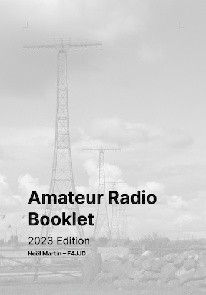

# HamBooklet

The booklet consists in a summary of all the needed data when you
are operating. The booklet covers all the IARU regions :globe_with_meridians:

## Table of Contents

* Band Plans
* Q Codes
* Morse Code
* Digital Modes
* International Beacon Project
* Prefixes Allocation
* Physics
* Mathematics

## Organization

### Final Document

The document is a PDF named [`booklet.pdf`](booklet.pdf), the document is intended to be printed on a A5 page format.

### Booklet Sources

The sources of the booklet are contained within the file `booklet.odt` in the OpenDocument format (XML derived); the recommended editor is [LibreOffice](https://www.libreoffice.org/). The document is written entirely with the font [Inter](https://github.com/rsms/inter), under the SIL Open Font License.

### Prefixes

The prefixes are available within the `.xlsx` format from ITU, I converted them into `.csv` for further analysis. Actually, they are not grouped by country, so for each entry `##A — ##Z` there is a row associated. Within the directory `/groupby` you can find the Golang code for grouping all the ranges to an human-readable format.

## Work In Progress

* 70 cm band plans
* Physics, reorganization of the chapter
* APRS Frequencies
* AMSAT
* SOTA

## License

Amateur Radio Booklet © 2023 by Noël Martin F4JJD is licensed under CC BY-SA 4.0
To view a copy of this license, visit [CC BY-SA 4.0](http://creativecommons.org/licenses/by-sa/4.0/).

> This license requires that reusers give credit to the creator. It allows reusers to distribute, remix, adapt, and build upon the material in any medium or format, even for commercial purposes. If others remix, adapt, or build upon the material, they must license the modified material under identical terms.
